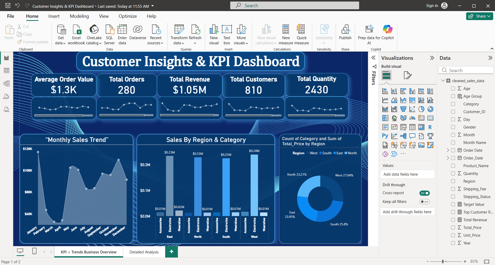
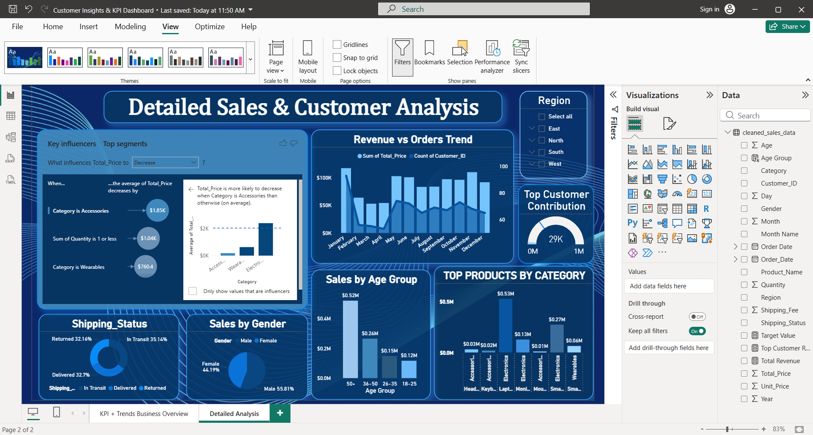

📊 Customer Insights & KPI Dashboard

📌 Project Overview
This project analyzes customer behavior, sales trends, and business KPIs using Power BI.

🎯 Objectives
- Track revenue, orders, and customer growth
- Analyze regional and category-wise sales
- Identify key business drivers using AI visuals

📊 Dashboard Preview

### Page 1: KPI Overview

### Page 2: Detailed Analysis

🛠 Tools Used
- Power BI
- Excel / CSV
- Python (for analysis)

📂 Dataset
- Sales_data.csv
- cleaned_sales_data.csv

🔍 Key Insights
- Electronics category generates highest revenue
- West region contributes maximum sales
- Customers aged 50+ drive highest revenue
- Accessories category reduces total price (from Key Influencers)

🚀 How to Use
1. Download `.pbix` file
2. Open in Power BI Desktop
3. Explore dashboards

👩‍💻 Author
Ruchi Parida
